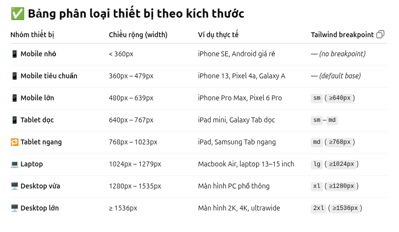

# Working with ReactJS + Vite in front-end size:

## 1. Set up:

Xem file [package.json](package.json) tải đúng các tool cần thiết về và nhớ là đúng phiên bản.

## 2. Chạy test code:

- `cd src/front-end` rồi `npm run dev` code sẽ chạy trực tiếp và update trực tiếp trên local host nên chạy 1 lần là oki.
- `npm run dev -- --host` sẽ chạy trên LAN rồi coi bên máy khác cho tiện cũng được hẹ hẹ.
- **Lưu ý**: muốn chạy được trang mình đang làm thì import và chỉ định nó chạy ở file [App.css](src/App.css) như cách mà Landing Page đang chạy. Ngoài ra các file nằm bên ngoài không đụng tới nữa nha.

## 3. Custome TailwindCSS ?:

- Có vài lệnh tailwind hong có nên phải custome nó vào [index.css](src/index.css), file đang custome lệnh làm ẩn thanh cuộn á.
- Về màu sắc: khác với css, tailwind nó config cho một thư viện màu rất lớn rồi nên ưu tiên xài nó, hạn chế ccustome thêm vì web mình ưu tiên response time á nha.
- _Xài sao ?_ Figma nó sẽ hiện mã màu dạng `#b2b2b2d1` chẳng hạn, copy quăng gpt rồi nó lựa màu cho.
- Lệnh cơ bản tailwind ở đây: https://tailwindcss.com/docs/. Hong coi cũng được làm xíu rồi quen ^^

## 4. Lưu ảnh:

Lưu ở [assets](src/assets) không lưu ở [public](public). Các ảnh xài luôn thì để ở [img](src/assets/img) còn các ảnh sẽ thay như poster phim thì để ở [sample](src/assets/sample).

## 5. Flow làm việc:

- Task sẽ là các screen, từng screen là 1 page, tạo 1 file trong thư mục [pages](src/pages)
- Mỗi page có nhiều layout, từng layout tạo riêng biệt cho từng trang và đặt tên cụ thể trong [layouts](src/layouts)
- Các layout sẽ chứa nhiều component, component nào sẽ gắn hook (cài logic) vào thì tạo file riêng trong [components](src/components) để dễ kiểm soát. Trong đó:
    - [buttons](src/components/buttons) lưu các nút bấm
    - [display](src/components/display) lưu các thành phần mà cuộn ra cuộn vô, đóng mở nội dung hoặc modal
    - [UI](src/components/UI) chứa các thành phần hiển thị thông tin là chủ yếu
    - Nằm bên ngoài: Tái sử dụng nhiều.  
      => Mang tính tương đối thôi nên để sao hợp lí cũng được.

## 6. Responsive:

**_LÀM TỪ ĐẦU MAI MỐT KHỎI CẦN GIAI ĐOẠN ĐI RESPONSIVE._**  
Xem ở: https://tailwindcss.com/docs/responsive-design và YouTube. 
Tham khảo ở: [navButton.jsx](src/components/buttons/header/navButton.jsx)  
Thấy dòng code `
` hong?  
Đại loại nó là Breakpoint, ứng với mỗi loại màn hình sẽ quy định size của Component khác nhau. Cụ thể xem ở trong tai liệu ở trên á.

Sau khi text thì màn hình ngang iPad và laptop sẽ dùng `lg:`  
Màn hình dọc iPad tui sẽ khoảng `sm:` và `md:`  
Và màn hình ngang điện thoại là cỡ `sm:`  
Màn hình dọc đt **mobile** nhỏ hơn sm nữa nên nó sẽ không : gì hết cái `w-[3px]` á.  
Nên thống nhất sẽ luôn config lg, md, sm và default là nhỏ hơn sm. Component nào nhỏ quá không chia được bỏ đỡ sm gộp sm với defaut cũng được.

## React:

Tự học
